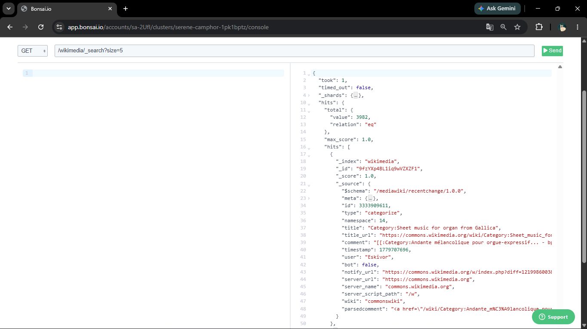

# Wikimedia Streaming

Real-Time Data Pipeline menggunakan Apache Kafka dan OpenSearch untuk mengonsumsi data perubahan artikel Wikimedia secara streaming, mendistribusikannya melalui Kafka, dan melakukan indexing ke OpenSearch untuk kebutuhan pencarian dan analisis data secara near real-time.

---

# Daftar Isi
- Arsitektur Sistem
- Teknologi yang Digunakan
- Alur Data
- Komponen Sistem
- Struktur Proyek
- Implementasi
    - Kafka Producer
    - Kafka Consumer
    - OpenSearch Integration
- Kesimpulan
- Cara Menjalankan
- Pengembangan Selanjutnya

---

# Arsitektur Sistem


Gambar 1. Arsitektur keseluruhan sistem Wikimedia Streaming.

Diagram menunjukkan alur data mulai dari Wikimedia Event Stream → Kafka Producer → Kafka Topic → Kafka Consumer → OpenSearch.

---

# Teknologi yang Digunakan

| Teknologi         | Fungsi                             |
|-------------------|------------------------------------|
| Java              | Bahasa pemrograman utama           |
| Apache Kafka      | Distributed Message Broker         |
| SLF4j             | Logging System                     |
| OkHttp3 SSE       | Mengonsumsi Wikimedia Event Stream |
| OpenSearch        | Penyimpanan dan pencarian data     |
| Bonsai OpenSearch | Managed OpenSearch Service         |
| Jackson           | JSON Processing                    |
| Maven             | Dependency Management              |

---

# Wikimedia Data


Gambar 2. Sampel Data Wikimedia

Data diperoleh dari Wikimedia Event Streams melalui protokol Server-Sent Events (SSE). Aliran data ini menyediakan informasi real-time tentang perubahan terbaru (recent changes) di berbagai proyek Wikimedia, seperti Wikipedia, Wikidata, dan lainnya.

## Format Data
Setiap pesan mengikuti format SSE dengan dua baris utama:
- `event: message`: menandakan bahwa ini adalah pesan data.
- `data: {...}`: berisi objek JSON dengan skema `/mediawiki/recentchange/1.0.0`.

## Contoh Data:

### SSE Event
```text
event: message

id: [
  {
    "topic": "eqiad.mediawiki.recentchange",
    "partition": 0,
    "timestamp": 1780390884394
  }
]

data: {...}
```

### Payload JSON

```json
{
  "$schema": "/mediawiki/recentchange/1.0.0",
  "meta": {
    "domain": "pt.wikipedia.org",
    "stream": "mediawiki.recentchange",
    "dt": "2026-06-02T09:01:24.393Z",
    "topic": "eqiad.mediawiki.recentchange",
    "partition": 0,
    "offset": 6198982691
  },
  "id": 143360863,
  "type": "edit",
  "namespace": 5,
  "title": "Wikipédia Discussão:Wikiconcurso Wiki Loves Minas Gerais/Artigos",
  "comment": "Ajuda com relação a pedido de eliminação de artigo proposto",
  "timestamp": 1780390880,
  "user": "DarwIn",
  "bot": false,
  "minor": false,
  "patrolled": true,
  "length": {
    "old": 51430,
    "new": 51997
  },
  "revision": {
    "old": 72364584,
    "new": 72365705
  },
  "wiki": "ptwiki"
}
```

### Penjelasan Field Penting

| Field          | Deskripsi                                        |
| -------------- | ------------------------------------------------ |
| `id`           | ID unik perubahan artikel                        |
| `type`         | Jenis aktivitas, misalnya edit, new, atau log    |
| `title`        | Judul artikel yang mengalami perubahan           |
| `user`         | Pengguna yang melakukan perubahan                |
| `comment`      | Ringkasan perubahan yang dilakukan               |
| `timestamp`    | Waktu perubahan dalam Unix Timestamp             |
| `length.old`   | Ukuran artikel sebelum perubahan                 |
| `length.new`   | Ukuran artikel setelah perubahan                 |
| `revision.old` | ID revisi sebelumnya                             |
| `revision.new` | ID revisi terbaru                                |
| `wiki`         | Kode wiki tempat perubahan terjadi               |
| `meta.stream`  | Nama stream Wikimedia                            |
| `meta.topic`   | Topic internal Wikimedia yang menghasilkan event |


---

# Alur Proses Data


Gambar 3. Alur data dari Wikimedia Event Stream hingga tersimpan di OpenSearch.

Tahapan proses:

1. Producer membuka koneksi SSE ke Wikimedia.
2. Event perubahan artikel diterima secara real-time.
3. Producer mengirim event ke Kafka Topic.
4. Consumer membaca event dari Kafka.
5. Consumer melakukan parsing JSON.
6. Data di-index ke OpenSearch.
7. Data dapat dicari dan dianalisis melalui OpenSearch.

---

# Komponen Sistem

## Kafka Producer

Tanggung jawab:
- Membuka koneksi ke Wikimedia Event Stream.
- Mengonsumsi event menggunakan SSE.
- Mengirim event ke Kafka Topic.
- Menjaga aliran data secara kontinu.

---

## Kafka Consumer

Tanggung jawab:
- Membaca event dari Kafka Topic.
- Melakukan parsing JSON.
- Mengekstrak informasi penting.
- Menyimpan dokumen ke OpenSearch.

---

## OpenSearch Integration

Fungsi:
- Penyimpanan dokumen hasil streaming.
- Near real-time indexing.
- Search dan analytics.

---

# Struktur Proyek

```text
wikimedia-streaming/
│
├── assets/
│
├── consumer-wikimedia-service/
│   └── WikimediaConsumerApp.java
│
├── logs
│   ├── consumer
│   └── producer
│
├── producer-wikimedia-service/
│   ├── WikimediaListener.java
│   └── WikimediaProducerApp.java
│
└── README.md
```

Penjelasan Struktur Project
- `assets`: Berisi gambar, diagram arsitektur, screenshot, dan dokumentasi visual yang digunakan dalam README.
- `consumer-wikimedia-service`: Modul Kafka Consumer yang bertugas membaca event dari Kafka Topic dan melakukan indexing data ke OpenSearch.
  - `WikimediaConsumerApp.java`: Entry point aplikasi consumer yang menginisialisasi Kafka Consumer dan proses indexing ke OpenSearch.
- `logs`: Berisi file pesan atau log yang dihasilkan oleh Producer dan Consumer.
- `producer-wikimedia-service`: Modul Kafka Producer yang bertugas mengonsumsi data dari Wikimedia Event Stream dan mengirimkannya ke Kafka Topic.
  - `WikimediaListener.java`: Implementasi SSE listener menggunakan OkHttp3 untuk menerima event perubahan artikel Wikimedia secara real-time dan meneruskannya ke Kafka Producer.
  - `WikimediaProducerApp.java`: Entry point aplikasi producer yang menginisialisasi Kafka Producer, membangun koneksi ke Wikimedia Event Stream, dan menjalankan proses streaming data menuju Kafka.

---

# Implementasi

Pada Bagian ini menampilkan hasil-hasil dari pada pengembangan program yang telah berhasil dilakukan.

## Kafka Producer


Gambar 4. Producer berhasil menerima event Wikimedia dan mengirimkannya ke Kafka.

Implementasi Kafka Producer berhasil membangun koneksi ke Wikimedia Event Stream menggunakan mekanisme Server-Sent Events (SSE) dan menerima data perubahan artikel secara real-time. Setiap event yang diterima kemudian dipublikasikan ke Kafka Topic untuk diproses oleh komponen downstream.

Berdasarkan log pada gambar di atas, dapat disimpulkan bahwa producer berhasil:
- Membangun koneksi ke Wikimedia Event Stream.
- Menerima event perubahan artikel secara kontinu.
- Mengirim payload JSON ke Kafka Topic.

---

## Kafka Consumer


Gambar 5. Consumer berhasil membaca event dari Kafka dan memproses data.

Implementasi Kafka Consumer bertugas mengonsumsi event yang dipublikasikan oleh producer ke Kafka Topic, melakukan pemrosesan data, serta menyimpan dokumen ke OpenSearch menggunakan mekanisme bulk indexing.

Berdasarkan log pada gambar di atas, consumer berhasil:

* Membaca data dari Kafka Topic menggunakan mekanisme polling.
* Memproses event secara batch.
* Melakukan bulk indexing ke OpenSearch.
* Menyelesaikan seluruh siklus pemrosesan data dengan status berhasil.

Log juga mencatat informasi operasional seperti jumlah record yang diproses dan waktu yang dibutuhkan untuk setiap tahap pemrosesan.

### Ringkasan Implementasi Consumer

| Aktivitas                 | Status   |
| ------------------------- | -------- |
| Kafka Polling             | Berhasil |
| Event Processing          | Berhasil |
| OpenSearch Bulk Indexing  | Berhasil |
| End-to-End Pipeline Cycle | Berhasil |

### Contoh Hasil Eksekusi

| Batch Size  | OpenSearch Duration | Total Pipeline Duration | Status  |
| ----------- | ------------------- | ----------------------- | ------- |
| 3 Records   | 634 ms              | 2981 ms                 | SUCCESS |
| 27 Records  | 1065 ms             | 2240 ms                 | SUCCESS |
| 72 Records  | 1695 ms             | 3069 ms                 | SUCCESS |
| 106 Records | 2498 ms             | 3534 ms                 | SUCCESS |

Berdasarkan hasil tersebut, consumer berhasil memproses beberapa batch data dengan ukuran yang berbeda dan seluruh proses indexing ke OpenSearch berhasil diselesaikan tanpa kegagalan.


## Data pada OpenSearch


Gambar 7. Data hasil indexing yang tersimpan pada OpenSearch.

OpenSearch digunakan sebagai media penyimpanan dan pencarian untuk event perubahan yang diperoleh dari Wikimedia Event Stream. Setelah event diterima dan diproses oleh Kafka Consumer, setiap event diindeks ke dalam index `wikimedia` menggunakan mekanisme bulk indexing.

Berdasarkan hasil query pada gambar di atas, index `wikimedia` berhasil menyimpan sebanyak 3.982 event perubahan yang berasal dari berbagai proyek Wikimedia. Event tersebut mencakup informasi seperti jenis perubahan, judul halaman, pengguna yang melakukan perubahan, waktu kejadian, serta metadata lainnya yang dipublikasikan oleh Wikimedia.

Data yang telah diindeks dapat dicari kembali menggunakan OpenSearch Query API sehingga memungkinkan proses observasi, pencarian, dan analisis aktivitas Wikimedia secara near real-time.

### Ringkasan Implementasi OpenSearch

| Aktivitas                                    | Status   |
| -------------------------------------------- | -------- |
| Pembuatan Index `wikimedia`                  | Berhasil |
| Penerimaan Event dari Kafka Consumer         | Berhasil |
| Bulk Indexing ke OpenSearch                  | Berhasil |
| Penyimpanan Event Perubahan Wikimedia        | Berhasil |
| Pencarian Data Menggunakan Query API         | Berhasil |
| Pengambilan Kembali Dokumen (Data Retrieval) | Berhasil |

---

# Kesimpulan

Proyek Wikimedia Streaming berhasil mengimplementasikan pipeline data streaming secara end-to-end menggunakan Apache Kafka dan OpenSearch.

Data perubahan artikel yang dipublikasikan oleh Wikimedia Event Stream berhasil dikonsumsi secara real-time menggunakan Kafka Producer, didistribusikan melalui Kafka Topic, kemudian diproses oleh Kafka Consumer dan diindeks ke OpenSearch.

Hasil implementasi menunjukkan bahwa event perubahan Wikimedia dapat disimpan dan dicari kembali menggunakan OpenSearch Query API, sehingga memungkinkan proses observasi dan analisis aktivitas Wikimedia secara near real-time.

Melalui proyek ini, beberapa konsep penting dalam pengembangan data pipeline berhasil diterapkan, antara lain:
- Real-time data ingestion menggunakan Server-Sent Events (SSE).
- Message streaming menggunakan Apache Kafka.
- Event processing menggunakan Kafka Consumer.
- Bulk indexing ke OpenSearch.
- Near real-time search dan retrieval menggunakan OpenSearch.

Proyek ini dapat dikembangkan lebih lanjut dengan menambahkan fitur monitoring, dashboard visualisasi, schema validation, serta deployment menggunakan container dan orchestration platform seperti Docker dan Kubernetes.


---

# Cara Menjalankan

## Menjalankan Kafka Server (Dengan Kafka Raft/KRAFT)

```bash
kafka-storage.sh \
  format -t $(kafka-storage.sh random-uuid) \
  -c your-kafka-home/config/kraft/server.properties

kafka-server-start.sh your-kafka-home/config/kraft/server.properties
```

## Membuat Topic Kafka (Contoh)

```bash
kafka-topics.sh --create \
  --topic wikimedia.recentChange \
  --partition 2 \
  --bootstrap-server localhost:9092
```

## Menjalankan Producer

```bash
mvn exec:java
```

## Menjalankan Consumer

```bash
mvn exec:java
```

---

# Rencana Pengembangan Mendatang

- Docker Compose Deployment
- Kafka Connect Integration
- Schema Registry
- Elasticsearch/OpenSearch Dashboard
- Retry Mechanism
- Dead Letter Queue (DLQ)
- Monitoring menggunakan Prometheus dan Grafana
- Multi-partition Kafka Processing
