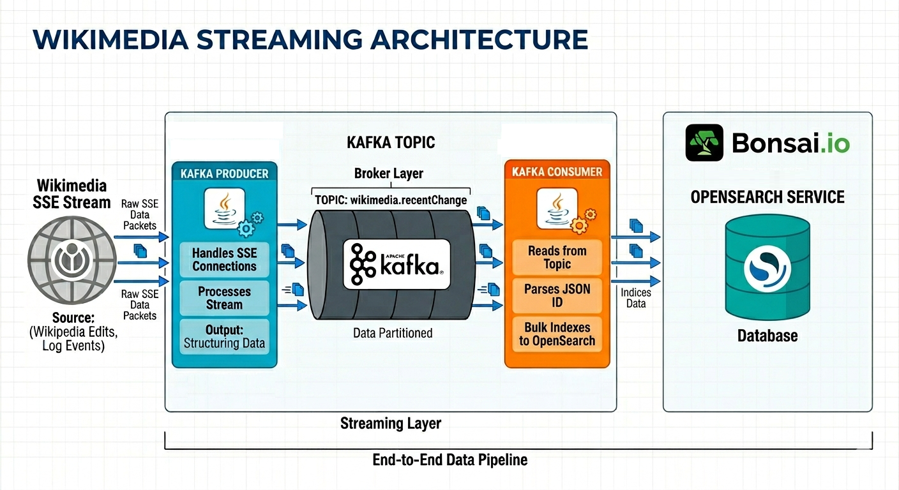
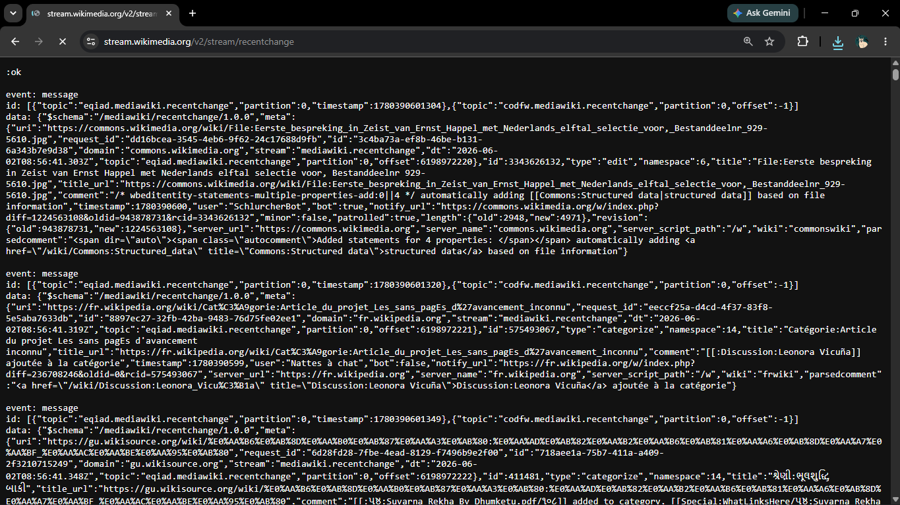
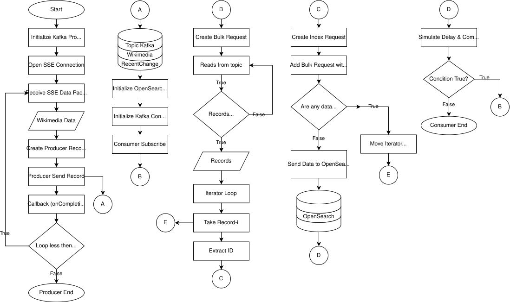
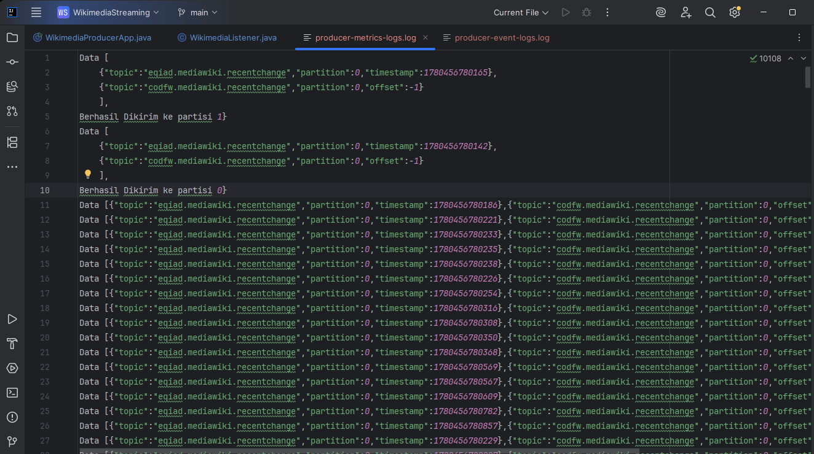
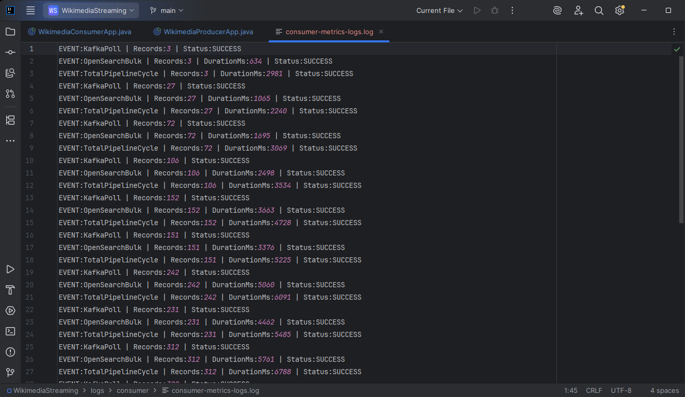

# Wikimedia Streaming

Real-Time Data Pipeline menggunakan Apache Kafka dan OpenSearch untuk mengonsumsi data perubahan artikel Wikimedia secara streaming, mendistribusikannya melalui Kafka, dan melakukan indexing ke OpenSearch untuk kebutuhan pencarian dan analisis data secara near real-time.

---

# Daftar Isi
- Arsitektur Sistem
- Teknologi yang Digunakan
- Alur Data
- Komponen Sistem
- Struktur Proyek
- Implementasi
    - Kafka Producer
    - Kafka Consumer
    - OpenSearch Integration
- End-to-End Pipeline Validation
- Hasil Pengujian
- Cara Menjalankan
- Pengembangan Selanjutnya

---

# Arsitektur Sistem


Gambar 1. Arsitektur keseluruhan sistem Wikimedia Streaming.

Diagram menunjukkan alur data mulai dari Wikimedia Event Stream → Kafka Producer → Kafka Topic → Kafka Consumer → OpenSearch.

---

# Teknologi yang Digunakan

| Teknologi         | Fungsi                             |
| ----------------- | ---------------------------------- |
| Java              | Bahasa pemrograman utama           |
| Apache Kafka      | Distributed Message Broker         |
| OkHttp3 SSE       | Mengonsumsi Wikimedia Event Stream |
| OpenSearch        | Penyimpanan dan pencarian data     |
| Bonsai OpenSearch | Managed OpenSearch Service         |
| Jackson           | JSON Processing                    |
| Maven             | Dependency Management              |

---

# Wikimedia Data


Gambar 2. Sampel Data Wikimedia

Data diperoleh dari Wikimedia Event Streams melalui protokol Server-Sent Events (SSE). Aliran data ini menyediakan informasi real-time tentang perubahan terbaru (recent changes) di berbagai proyek Wikimedia, seperti Wikipedia, Wikidata, dan lainnya.

## Format Data
Setiap pesan mengikuti format SSE dengan dua baris utama:
- `event: message`: menandakan bahwa ini adalah pesan data.
- `data: {...}`: berisi objek JSON dengan skema `/mediawiki/recentchange/1.0.0`.

## Contoh Data:

### SSE Event
```text
event: message

id: [
  {
    "topic": "eqiad.mediawiki.recentchange",
    "partition": 0,
    "timestamp": 1780390884394
  }
]

data: {...}
```

### Payload JSON

```json
{
  "$schema": "/mediawiki/recentchange/1.0.0",
  "meta": {
    "domain": "pt.wikipedia.org",
    "stream": "mediawiki.recentchange",
    "dt": "2026-06-02T09:01:24.393Z",
    "topic": "eqiad.mediawiki.recentchange",
    "partition": 0,
    "offset": 6198982691
  },
  "id": 143360863,
  "type": "edit",
  "namespace": 5,
  "title": "Wikipédia Discussão:Wikiconcurso Wiki Loves Minas Gerais/Artigos",
  "comment": "Ajuda com relação a pedido de eliminação de artigo proposto",
  "timestamp": 1780390880,
  "user": "DarwIn",
  "bot": false,
  "minor": false,
  "patrolled": true,
  "length": {
    "old": 51430,
    "new": 51997
  },
  "revision": {
    "old": 72364584,
    "new": 72365705
  },
  "wiki": "ptwiki"
}
```

### Penjelasan Field Penting

| Field          | Deskripsi                                        |
| -------------- | ------------------------------------------------ |
| `id`           | ID unik perubahan artikel                        |
| `type`         | Jenis aktivitas, misalnya edit, new, atau log    |
| `title`        | Judul artikel yang mengalami perubahan           |
| `user`         | Pengguna yang melakukan perubahan                |
| `comment`      | Ringkasan perubahan yang dilakukan               |
| `timestamp`    | Waktu perubahan dalam Unix Timestamp             |
| `length.old`   | Ukuran artikel sebelum perubahan                 |
| `length.new`   | Ukuran artikel setelah perubahan                 |
| `revision.old` | ID revisi sebelumnya                             |
| `revision.new` | ID revisi terbaru                                |
| `wiki`         | Kode wiki tempat perubahan terjadi               |
| `meta.stream`  | Nama stream Wikimedia                            |
| `meta.topic`   | Topic internal Wikimedia yang menghasilkan event |


---

# Alur Proses Data


Gambar 3. Alur data dari Wikimedia Event Stream hingga tersimpan di OpenSearch.

Tahapan proses:

1. Producer membuka koneksi SSE ke Wikimedia.
2. Event perubahan artikel diterima secara real-time.
3. Producer mengirim event ke Kafka Topic.
4. Consumer membaca event dari Kafka.
5. Consumer melakukan parsing JSON.
6. Data di-index ke OpenSearch.
7. Data dapat dicari dan dianalisis melalui OpenSearch.

---

# Komponen Sistem

## Kafka Producer

Tanggung jawab:
- Membuka koneksi ke Wikimedia Event Stream.
- Mengonsumsi event menggunakan SSE.
- Mengirim event ke Kafka Topic.
- Menjaga aliran data secara kontinu.

---

## Kafka Consumer

Tanggung jawab:
- Membaca event dari Kafka Topic.
- Melakukan parsing JSON.
- Mengekstrak informasi penting.
- Menyimpan dokumen ke OpenSearch.

---

## OpenSearch Integration

Fungsi:
- Penyimpanan dokumen hasil streaming.
- Near real-time indexing.
- Search dan analytics.

---

# Struktur Proyek

```text
wikimedia-streaming/
│
├── assets/
│   ├── system-architecture.png
│   ├── data-flow.png
│   ├── kafka-producer-flow.png
│   ├── kafka-consumer-flow.png
│   ├── opensearch-integration.png
│   ├── kafka-topic-message.png
│   ├── opensearch-dashboard.png
│   └── producer-consumer-logs.png
│
├── consumer-wikimedia-service/
│   └── WikimediaConsumerApp.java
│
├── producer-wikimedia-service/
│   ├── WikimediaListener.java
│   └── WikimediaProducerApp.java
│
└── README.md
```

Penjelasan Struktur Project
- `assets`: Berisi gambar, diagram arsitektur, screenshot, dan dokumentasi visual yang digunakan dalam README.
- `consumer-wikimedia-service`: Modul Kafka Consumer yang bertugas membaca event dari Kafka Topic dan melakukan indexing data ke OpenSearch.
  - `WikimediaConsumerApp.java`: Entry point aplikasi consumer yang menginisialisasi Kafka Consumer dan proses indexing ke OpenSearch.
- `producer-wikimedia-service`: Modul Kafka Producer yang bertugas mengonsumsi data dari Wikimedia Event Stream dan mengirimkannya ke Kafka Topic.
  - `WikimediaListener.java`: Implementasi SSE listener menggunakan OkHttp3 untuk menerima event perubahan artikel Wikimedia secara real-time dan meneruskannya ke Kafka Producer.
  - `WikimediaProducerApp.java`: Entry point aplikasi producer yang menginisialisasi Kafka Producer, membangun koneksi ke Wikimedia Event Stream, dan menjalankan proses streaming data menuju Kafka.

---

# Implementasi

## Kafka Producer


Gambar 4. Producer berhasil menerima event Wikimedia dan mengirimkannya ke Kafka.

Fitur utama:

- SSE Connection
- Event Streaming
- Kafka Producer API
- JSON Message Delivery

---

## Kafka Consumer


Gambar 5. Consumer berhasil membaca event dari Kafka dan memproses data.

Fitur utama:

- Kafka Consumer API
- JSON Processing
- OpenSearch Indexing

---

## Contoh Data Kafka


Gambar 6. Contoh pesan yang diterima Kafka Topic dari Wikimedia Stream.

---

## Data pada OpenSearch


Gambar 7. Data hasil indexing yang tersimpan pada OpenSearch.

---
# End-to-End Pipeline Validation

Pipeline berhasil memproses data dari Wikimedia Event Stream hingga OpenSearch.

Tahapan yang berhasil divalidasi:
- Producer berhasil menerima event Wikimedia.
- Producer berhasil mengirim event ke Kafka Topic.
- Consumer berhasil membaca event dari Kafka.
- Consumer berhasil melakukan parsing JSON.
- Consumer berhasil melakukan indexing ke OpenSearch.
- Dokumen berhasil dicari kembali melalui OpenSearch.

---
# Hasil Pengujian


Gambar 8. Pengujian end-to-end pipeline berhasil memindahkan data dari Wikimedia Stream hingga OpenSearch.


---

# Cara Menjalankan

## Menjalankan Kafka

```
docker compose up -d
```

## Menjalankan Producer

```bash
mvn exec:java
```

## Menjalankan Consumer

```bash
mvn exec:java
```

---

# Rencana Pengembangan Mendatang

- Docker Compose Deployment
- Kafka Connect Integration
- Schema Registry
- Elasticsearch/OpenSearch Dashboard
- Retry Mechanism
- Dead Letter Queue (DLQ)
- Monitoring menggunakan Prometheus dan Grafana
- Multi-partition Kafka Processing
